# pytorch-deep-generative-replay

PyTorch implementation of [Continual Learning with Deep Generative Replay, NIPS 2017](https://arxiv.org/abs/1705.08690)

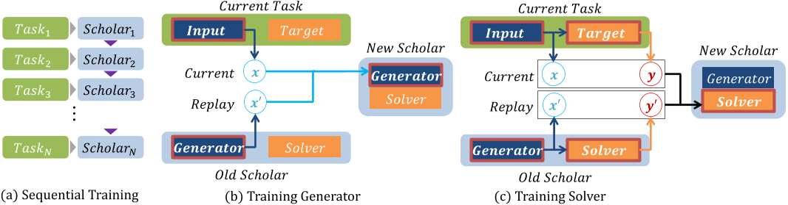


## Results

### Continual Learning on Permutated MNISTs

- Test precisions **without replay** (*left*), **with exact replay** (*middle*), and **with Deep Generative Replay** (*right*).

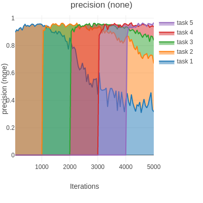 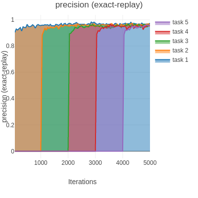 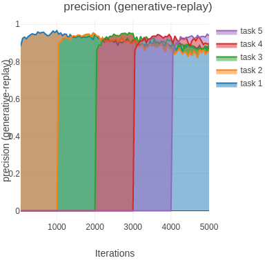

### Continual Learning on MNIST-SVHN

- Test precisions **without replay** (*left*), **with exact replay** (*middle*), and **with Deep Generative Replay** (*right*).

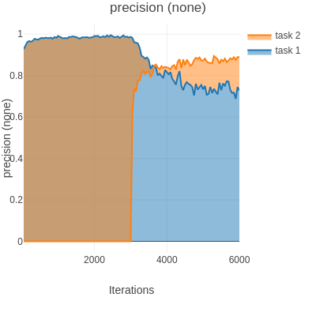  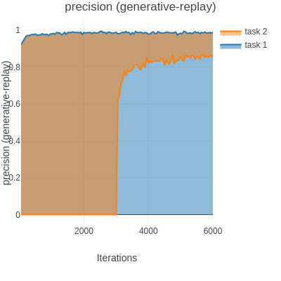

- Generated samples from the scholar trained **without any replay** (*left*) and **with Deep Generative Replay** (*right*).

 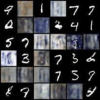 

- Training scholar's generator **without replay** (*left*) and **with Deep Generative Replay** (*right*).

  

### Continual Learning on SVHN-MNIST

- Test precisions **without replay** (*left*), **with exact replay** (*middle*), and **with Deep Generative Replay** (*right*).

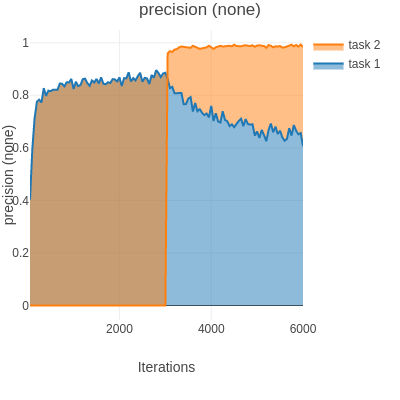 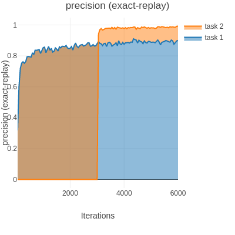 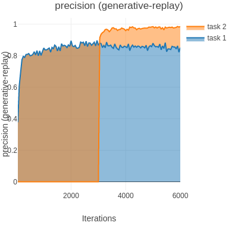

- Generated samples from the scholar trained **without replay** (*left*) and **with Deep Generative Replay** (*right*).

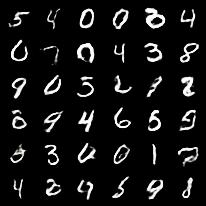 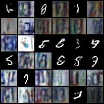 

- Training scholar's generator **without replay** (*left*) and **with Deep Generative Replay** (*right*).

  


## Installation
```shell
$ git clone https://github.com/kuc2477/pytorch-deep-generative-replay
$ pip install -r pytorch-deep-generative-replay/requirements.txt
```

## Commands

### Usage
```shell
$ ./main.py --help
$ usage: PyTorch implementation of Deep Generative Replay [-h]
                                                          [--experiment {permutated-mnist,svhn-mnist,mnist-svhn}]
                                                          [--mnist-permutation-number MNIST_PERMUTATION_NUMBER]
                                                          [--mnist-permutation-seed MNIST_PERMUTATION_SEED]
                                                          --replay-mode
                                                          {exact-replay,generative-replay,none}
                                                          [--generator-z-size GENERATOR_Z_SIZE]
                                                          [--generator-c-channel-size GENERATOR_C_CHANNEL_SIZE]
                                                          [--generator-g-channel-size GENERATOR_G_CHANNEL_SIZE]
                                                          [--solver-depth SOLVER_DEPTH]
                                                          [--solver-reducing-layers SOLVER_REDUCING_LAYERS]
                                                          [--solver-channel-size SOLVER_CHANNEL_SIZE]
                                                          [--generator-c-updates-per-g-update GENERATOR_C_UPDATES_PER_G_UPDATE]
                                                          [--generator-iterations GENERATOR_ITERATIONS]
                                                          [--solver-iterations SOLVER_ITERATIONS]
                                                          [--importance-of-new-task IMPORTANCE_OF_NEW_TASK]
                                                          [--lr LR]
                                                          [--weight-decay WEIGHT_DECAY]
                                                          [--batch-size BATCH_SIZE]
                                                          [--test-size TEST_SIZE]
                                                          [--sample-size SAMPLE_SIZE]
                                                          [--image-log-interval IMAGE_LOG_INTERVAL]
                                                          [--eval-log-interval EVAL_LOG_INTERVAL]
                                                          [--loss-log-interval LOSS_LOG_INTERVAL]
                                                          [--checkpoint-dir CHECKPOINT_DIR]
                                                          [--sample-dir SAMPLE_DIR]
                                                          [--no-gpus]
                                                          (--train | --test)

```

### To Run Full Experiments
```shell
# Run a visdom server and conduct full experiments
$ python -m visdom.server &
$ ./run_full_experiments
```

### To Run a Single Experiment
```shell
# Run a visdom server and conduct a desired experiment
$ python -m visdom.server &
$ ./main.py --train --experiment=[permutated-mnist|svhn-mnist|mnist-svhn] --replay-mode=[exact-replay|generative-replay|none]
```

### To Generate Images from the learned Scholar
```shell
$ # Run the command below and visit the "samples" directory
$ ./main.py --test --experiment=[permutated-mnist|svhn-mnist|mnist-svhn] --replay-mode=[exact-replay|generative-replay|none]
```

## Note
- I failed to find the supplementary materials that the authors mentioned in the paper to contain the experimental details. Thus, I arbitrarily chose a 4-convolutional-layer CNN as a solver in this project. If you know where I can find the additional materials, please let me know through the project's Github issue.

## Reference
- [Continual Learning with Deep Generative Replay, arxiv:1705.08690](https://arxiv.org/abs/1705.08690)


## Author
Ha Junsoo / [@kuc2477](https://github.com/kuc2477) / MIT License
